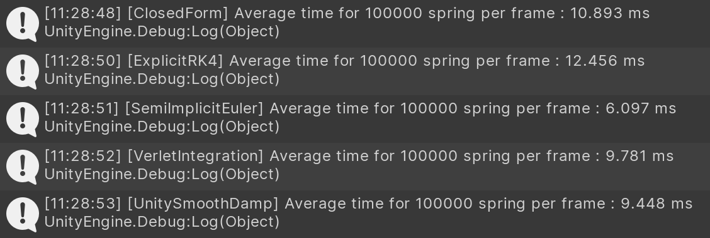
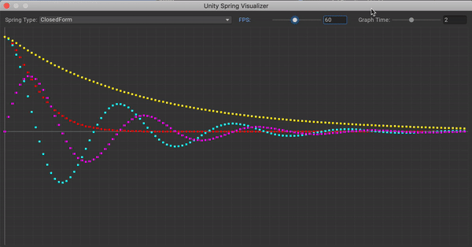

# A minimal spring physics library for Unity

Implement multiple solvers for damped harmonic oscillator.

Solvers:

- [x] [Closed-form solution for the ODE](http://www.ryanjuckett.com/programming/damped-springs/)
- [x] [Semi-implicit Euler method](https://en.wikipedia.org/wiki/Semi-implicit_Euler_method)
- [x] [Explicit Runge-Kutta 4th order aka RK4](https://en.wikipedia.org/wiki/Runge%E2%80%93Kutta_methods)
- [x] [Verlet Integration](https://en.wikipedia.org/wiki/Verlet_integration)

Maybe not:

- [ ] [Explicit Euler aka Forward Euler](https://en.wikipedia.org/wiki/Euler_method)
- [ ] [Implicit Euler aka Backward Euler](https://en.wikipedia.org/wiki/Backward_Euler_method)
- [ ] [Mid-point method](https://en.wikipedia.org/wiki/Midpoint_method)
- [ ] [Implicit Runge-Kutta 4th order aka RK4](https://en.wikipedia.org/wiki/Runge%E2%80%93Kutta_methods#Implicit_Runge%E2%80%93Kutta_methods)

Performance rough check with 2.6 GHz Intel Core i7:



# Install

via Package Manager UI

```
ssh://git@github.com/thammin/unity-spring.git
```

via [OpenUPM](https://openupm.com/packages/com.thammin.unity-spring/)

```
openupm add com.thammin.unity-spring
```

# Usage

Every solver is just a [simple class](https://github.com/thammin/unity-spring/blob/master/Runtime/SpringBase.cs) with few fields.

```cs
using UnityEngine;
using Spring = UnitySpring.ClosedForm.Spring;

public class Ball : MonoBehaviour
{
    Spring spring;

    void Start()
    {
        // interpolate from -10f to 10f
        spring = new Spring()
        {
            startValue = -10f,
            endValue = 10f
        };
    }

    void Update()
    {
        var x = spring.Evaluate(Time.deltaTime);
        transform.position = new Vector3(x, 0f, 0f);
    }
}
```

# Screenshot or demo

Visualizer:



# FAQ

### Unity SmoothDamp

Source code: [link](https://github.com/Unity-Technologies/UnityCsReference/blob/2019.3/Runtime/Export/Math/Mathf.cs#L302-L331)

Based on closed-form solution, but only modeling critically damped spring. Using tweaked Exponential approximation (up to Taylor 3rd order) which claims as roughly 80 times faster and approximate less than 0.1% error than `exp` function.


```cs
// tweaked coefficients
float exp = 1F / (1F + x + 0.48F * x * x + 0.235F * x * x * x);
```

# References

Analytical:

- http://www.entropy.energy/scholar/node/damped-harmonic-oscillator
- https://doc.lagout.org/Others/Game%20Development/Programming/Game%20Programming%20Gems%204.pdf

Numerical:

- http://box2d.org/files/GDC2015/ErinCatto_NumericalMethods.pdf

General:

- https://hplgit.github.io/num-methods-for-PDEs/doc/pub/vib/pdf/vib-4print-A4-2up.pdf

# License

MIT
