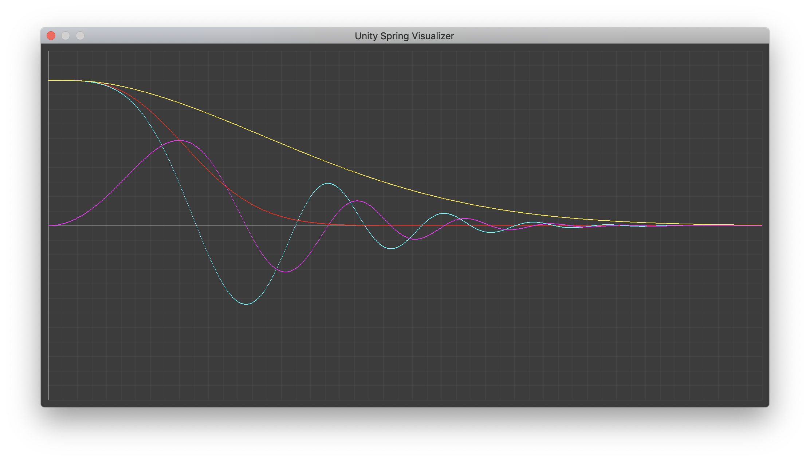

# A minimal spring physics library for Unity

Implement multiple solvers for damped harmonic oscillator.

Solvers:

-   [x] [Closed-form solution for the ODE](http://www.ryanjuckett.com/programming/damped-springs/)
-   [x] [Semi-implicit Euler method](https://en.wikipedia.org/wiki/Semi-implicit_Euler_method)

Maybe:

-   [ ] [Runge-Kutta 4th order aka RK4](https://en.wikipedia.org/wiki/Runge%E2%80%93Kutta_methods)
-   [ ] [Verlet Integration](https://en.wikipedia.org/wiki/Verlet_integration)

Maybe not:

-   [ ] [Explicit Euler aka Forward Euler](https://en.wikipedia.org/wiki/Euler_method)
-   [ ] [Implicit Euler aka Backward Euler](https://en.wikipedia.org/wiki/Backward_Euler_method)
-   [ ] [Mid-point method](https://en.wikipedia.org/wiki/Midpoint_method)

# Install

# Usage

# Screenshot or demo

Closed-form solution:


# Faq

## Unity SmoothDamp

Source code: [link](https://github.com/Unity-Technologies/UnityCsReference/blob/2019.3/Runtime/Export/Math/Mathf.cs#L302-L331)

Based on closed-form solution, but only modeling critically damped spring. Using tweaked Exponential approximation (up to Taylor 3rd order) which claims as roughly 80 times faster and approximate less than 0.1% error than `exp` function.


```cs
// tweaked coefficients
float exp = 1F / (1F + x + 0.48F * x * x + 0.235F * x * x * x);
```

# References

Analytical:

-   http://www.entropy.energy/scholar/node/damped-harmonic-oscillator
-   https://doc.lagout.org/Others/Game%20Development/Programming/Game%20Programming%20Gems%204.pdf

Numerical:

-   http://box2d.org/files/GDC2015/ErinCatto_NumericalMethods.pdf

General:

-   https://hplgit.github.io/num-methods-for-PDEs/doc/pub/vib/pdf/vib-4print-A4-2up.pdf

# License

MIT
